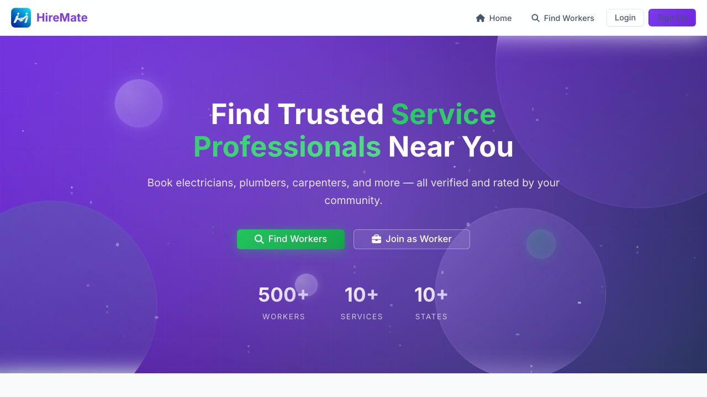
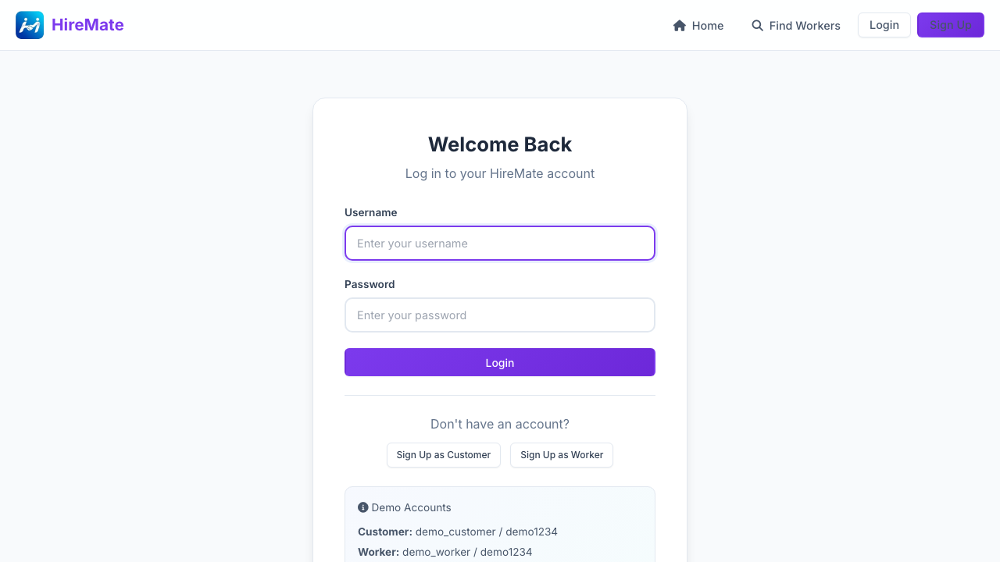
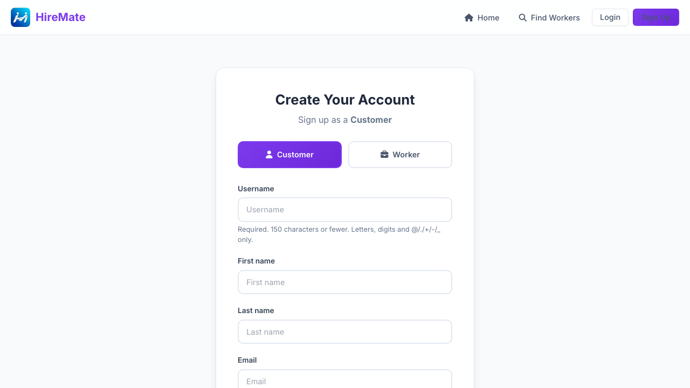
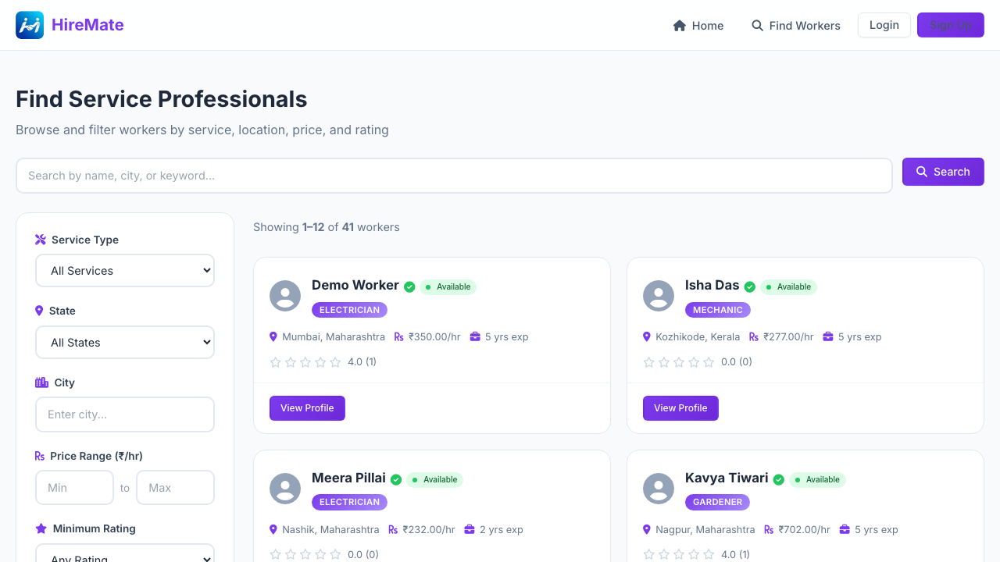

# HireMate - Job Marketplace Platform

<p align="center">
  
</p>

<p align="center">
  <strong>Connecting Communities Through Trusted Service Professionals</strong>
  <br>
  A Modern Job Marketplace Platform with Stunning UI/UX
</p>

---

## 🚀 Features

### Core Features
- **User Authentication** - Secure login/registration for customers and workers with social auth support (Google)
- **Worker Discovery** - Browse and search through verified service providers with filtering
- **Simplified Booking System** - Easy single-page booking with service type selection based on worker specialty
- **Rating & Reviews** - Rate workers after completed services (1-5 stars)
- **User Profiles** - Separate profiles for customers and workers

### Booking Enhancements
- **Smart Service Selection** - Service types automatically filter based on worker's specialty (e.g., Electrician shows only Wiring, Repair, Installation, Maintenance)
- **Google Maps Integration** - Interactive map for location selection with address search and auto-detect
- **Address Search** - Real-time address search using OpenStreetMap/Nominatim
- **Click on Map** - Pick exact location by clicking on interactive map
- **Use My Location** - Auto-detect current location for quick address entry
- **Address Auto-Fill** - Save multiple addresses and auto-fill from saved locations
- **Price Calculator** - Real-time price calculation with platform fee
- **Pay After Service** - Hassle-free payment option

### UI/UX Features ✨
- **Modern Glassmorphism Design** - Frosted glass effects with backdrop blur
- **3D Animated Background** - Floating glassmorphic blobs and glowing orbs
- **Gradient Mesh Animation** - Dynamic color-shifting background
- **Interactive Particle System** - Floating particles with twinkling effect
- **Parallax Mouse Effect** - Elements respond to cursor movement
- **Purple + Green Color Scheme** - Trust purple with conversion green CTAs
- **Smooth Hover Animations** - 200-300ms transitions for all interactive elements
- **Verified Badges** - Trust-building verification icons on worker profiles
- **Trust Section** - Dedicated section highlighting platform safety features
- **Responsive Design** - Works seamlessly on all devices (375px to 1440px+)
- **Accessible** - WCAG compliant color contrast and keyboard navigation

### Services Available
- Electrician
- Plumber
- Carpenter
- Painter
- Cleaner
- Mechanic
- Gardener
- AC Repair

---

## 🎨 Design System

### Color Palette
| Role | Color | Hex |
|------|-------|-----|
| Primary | Purple | `#7C3AED` |
| Primary Dark | Deep Purple | `#6D28D9` |
| Primary Light | Light Purple | `#A78BFA` |
| CTA (Call-to-Action) | Green | `#22C55E` |
| CTA Dark | Deep Green | `#16A34A` |
| Background | Off White | `#F8FAFC` |
| Text | Dark Slate | `#1E293B` |

### Typography
- **Font Family:** Inter (Google Fonts)
- **Weights:** 300, 400, 500, 600, 700

### UI Components
- Glassmorphic cards with `backdrop-filter: blur(20px)`
- Gradient backgrounds with smooth animations
- Floating orbs with glow effects
- Animated particle system
- Trust badges with verified icons

---

## 📊 Analytics Dashboard

The home page features an analytics section with:
- **Service Distribution** - Pie/Doughnut chart showing popular services
- **Monthly Bookings** - Bar chart comparing bookings month-over-month (Last Year vs This Year)
- **Customer Satisfaction** - Circular progress indicator with satisfaction rate
- **Live Statistics** - Animated counters for customers, workers, jobs completed

---

## 📸 Screenshots

### Home Page - Hero Section

*Modern 3D animated hero with glassmorphism background, floating orbs, and gradient mesh*

### Login Page

*Clean and modern login page with glassmorphic design*

### Register Page

*Easy registration for customers and workers*

### Worker Listing

*Browse and filter service providers with verified badges*

---

## 🛠️ Tech Stack

### Backend
- **Framework:** Django 4.2
- **Database:** SQLite (development), PostgreSQL (production)
- **Authentication:** Django Auth + Social Auth (Google OAuth)

### Frontend
- **HTML5, CSS3, JavaScript** - Core web technologies
- **Custom CSS** - Modern styling with glassmorphism
- **Chart.js** - Interactive charts and data visualization
- **Font Awesome 6** - Icon library
- **Google Fonts** - Inter font family
- **Leaflet.js** - Interactive maps
- **OpenStreetMap** - Map tiles and geocoding

### Maps & Location
- **Leaflet.js** - Interactive map display
- **OpenStreetMap** - Free map tiles
- **Nominatim API** - Address search and reverse geocoding
- **Geolocation API** - Browser-based location detection

### Hosting
- **PythonAnywhere** - Primary hosting
- **Railway** - Alternative deployment
- **Render** - Cloud hosting option

---

## ⚙️ Installation

### Prerequisites
- Python 3.10+
- pip
- Git

### Local Setup

```bash
# Clone the repository
git clone https://github.com/sagar-coder29/Hiremate.git
cd Hiremate

# Create virtual environment
python -m venv venv
source venv/bin/activate  # On Windows: venv\Scripts\activate

# Install dependencies
pip install -r requirements.txt

# Run migrations
python manage.py migrate

# Create superuser (optional)
python manage.py createsuperuser

# Seed sample data
python manage.py seed_data

# Start development server
python manage.py runserver
```

Open http://localhost:8000 in your browser.

---

## 🌐 Live Demo

**Live URL:** https://sagar-coder29.pythonanywhere.com

---

## 🔐 Demo Credentials

### Customer Account
- **Email:** demo_customer / customer@example.com
- **Password:** demo1234

### Worker Account
- **Email:** demo_worker / worker@example.com
- **Password:** demo1234

### Admin Account
- **Email:** admin@example.com
- **Password:** admin123

---

## 🚀 Deployment

### PythonAnywhere (Recommended)

1. Create account at [pythonanywhere.com](https://pythonanywhere.com)
2. Open Bash console and clone:
   ```bash
   git clone https://github.com/sagar-coder29/Hiremate.git
   ```
3. Create virtualenv and install:
   ```bash
   cd Hiremate
   python -m venv venv
   source venv/bin/activate
   pip install -r requirements.txt
   ```
4. Run migrations:
   ```bash
   python manage.py migrate
   ```
5. Configure web app in PythonAnywhere dashboard
6. Set static files path to `/home/username/Hiremate/static`

---

## 🎨 Customization

### Colors
Edit `static/css/style.css` CSS variables:
```css
:root {
    --primary: #7C3AED;
    --primary-dark: #6D28D9;
    --primary-light: #A78BFA;
    --cta: #22C55E;
    --cta-dark: #16A34A;
}
```

### Adding Screenshots
1. Take screenshots of each page (recommended size: 1200x600px)
2. Save them as PNG files in `static/images/screenshots/`
3. Update the image paths in this README

---

## 📝 Recent Updates

### v3.1 (April 2026)
- **Simplified Booking Page** - Removed multi-step wizard, single-page form
- **Smart Service Selection** - Service types filter based on worker's specialty
- **Google Maps Integration** - Interactive map with address search
- **Location Auto-Detect** - Use My Location button for quick address entry
- **Click on Map** - Pick exact location by clicking on map

### v3.0 (April 2026)
- **UI/UX Pro Max Design System** - Professional glassmorphism design
- **3D Animated Background** - Floating glassmorphic blobs, orbs, and particles
- **New Color Scheme** - Purple primary with green CTAs
- **Trust Section** - New section highlighting platform safety
- **Verified Badges** - Visual trust indicators on worker profiles
- **Smooth Animations** - Optimized 200-300ms transitions
- **Parallax Effects** - Interactive mouse-responsive elements

### v2.1 (March 2026)
- Added **Address Auto-Fill** system with saved addresses
- Implemented **Multiple Time Slot** selection (up to 3 preferred times)
- Added **Service Sub-Categories** based on worker service type
- Integrated **Click-to-Call** functionality for workers and customers
- Enhanced **Description Field** with character counter

### v2.0 (March 2026)
- Added **Chart.js** for data visualization
- Implemented **Monthly Bookings** bar chart with year-over-year comparison
- Added **Service Distribution** doughnut chart
- Created **Customer Satisfaction** circular progress indicator
- Added **Live Statistics** with animated counters
- Integrated **Google OAuth** social authentication

### v1.0 (Initial Release)
- User authentication system
- Worker listing and profiles
- Booking management
- Rating system
- Responsive design with animations

---

## 📝 License

This project is open source and available under the MIT License.

---

## 👨‍💻 Author

**Sagar Kumar Jha**
- GitHub: [@sagar-coder29](https://github.com/sagar-coder29)

---

## 🙏 Acknowledgments & Partners

Special thanks to our amazing development partners:

### AI Development Partner 🤖
**OpenCode (big-pickle model)**
- Collaborative coding assistant
- Feature development and bug fixes
- Code review and optimization
- Documentation improvements

### Human Team Members
- **Sagar Kumar Jha** - Lead Developer & Project Owner

### Technology Partners
- [Django](https://www.djangoproject.com/) - Backend Framework
- [Font Awesome](https://fontawesome.com) - Icons
- [Google Fonts](https://fonts.google.com) - Typography
- [Chart.js](https://www.chartjs.org/) - Data Visualization
- [Leaflet.js](https://leafletjs.com/) - Interactive Maps
- [OpenStreetMap](https://www.openstreetmap.org/) - Map Data
- [UI/UX Pro Max](https://uix.today/) - Design System Inspiration
- [shadcn/ui](https://ui.shadcn.com/) - UI Inspiration

---

## 💝 Special Thanks

This project was built with the invaluable assistance of **OpenCode** - an AI-powered coding assistant that helped with:
- Architectural decisions
- Feature implementation
- UI/UX improvements
- Bug fixes and debugging
- Code optimization
- Documentation

Without this partnership, many of the advanced features wouldn't be possible. Thank you for being an amazing coding companion!

---

⭐ If you found this project useful, please give it a star!
